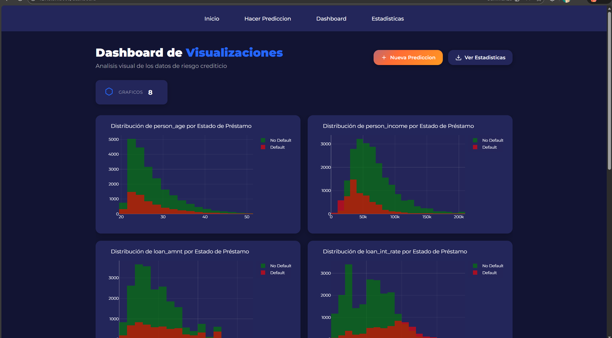
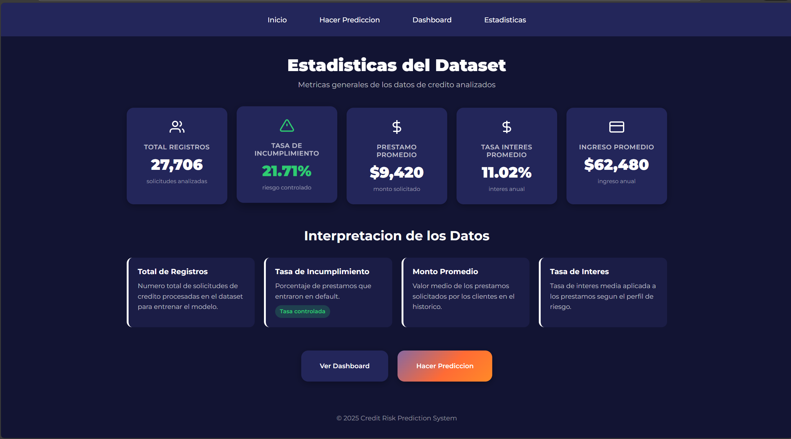
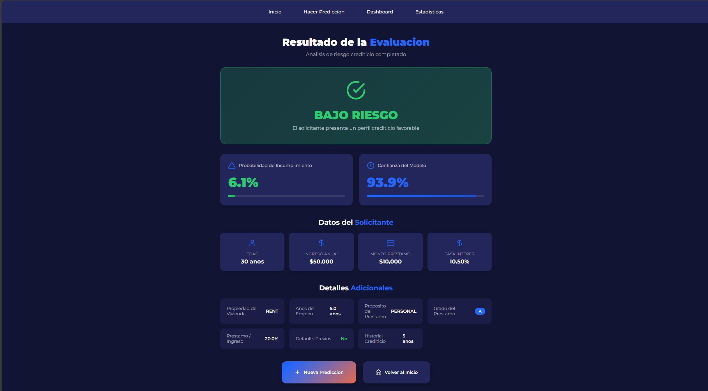

# Credit Risk Management System

Sistema de Gestión de Riesgo Crediticio | UNACH

---

## Table of Contents

- [Preview](#preview)
- [¿Por qué este proyecto?](#por-qué-este-proyecto)
- [Quick Start](#quick-start)
- [Project Structure](#project-structure)
- [Screenshots](#screenshots)

---

## Preview


---

## ¿Por qué este proyecto?

Este sistema fue desarrollado como proyecto formativo para integrar conceptos de **Arquitectura de Software** y **Ciencia de Datos** en una aplicación real.

### Objetivos de aprendizaje:
- Aplicar **Programación Orientada a Objetos (POO)**
- Implementar **estructuras de datos** manualmente (Heap / Cola de Prioridad)
- Desarrollar un pipeline de **Ingeniería de Datos (ETL)**
- Entrenar modelos de **Machine Learning** con Scikit-Learn
- Construir una aplicación web interactiva con **Flask**

### ¿Qué hace el sistema?
- Analiza datos históricos de clientes financieros
- Limpia y prepara datos aplicando técnicas estadísticas (IQR, imputación)
- Entrena un modelo de ML para estimar **riesgo crediticio**
- Visualiza resultados mediante gráficos interactivos con Plotly

---

## Quick Start

```bash
# 1. Clonar el repositorio
git clone <url-del-repositorio>
cd credit_risk_system

# 2. Crear entorno virtual
python -m venv venv

# Windows
venv\Scripts\activate

# Linux/Mac
source venv/bin/activate

# 3. Instalar dependencias
pip install -r requirements.txt

# 4. Entrenar el modelo
python train_model.py

# 5. Iniciar la aplicación
python app.py
```

Abre tu navegador en: `http://localhost:5000`

---

## Project Structure

```
credit_risk_system/
├── data/
│   ├── raw/                    # Dataset original
│   └── processed/              # Datos procesados
├── models/                     # Modelos entrenados (.pkl)
├── src/                        # Lógica de negocio
│   ├── data_structures.py      # MinHeap, MaxHeap
│   ├── data_processing.py      # ETL: Limpieza y transformación
│   ├── model.py                # Entrenamiento y predicción ML
│   └── visualizations.py       # Gráficos con Plotly
├── static/
│   ├── assets/
│   ├── img/
│   └── css/
├── templates/                  # Vistas HTML (Jinja2)
├── app.py                      # Punto de entrada Flask
├── config.py                   # Configuración
├── train_model.py              # Script de entrenamiento
└── requirements.txt
```

---

## Screenshots

### Dashboard - Gráficas


### Estadísticas


### Predicción


### Evaluación del Modelo


---

## Autor

**Luis Cutiopala** - UNACH
